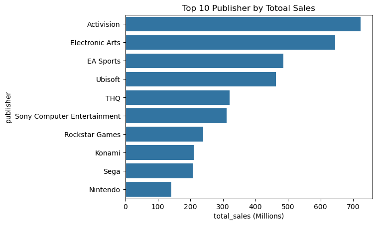
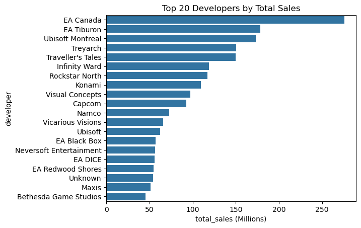
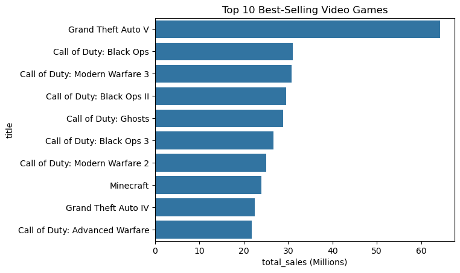
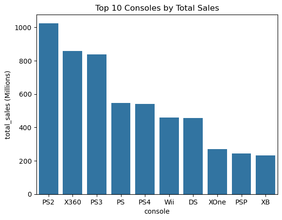
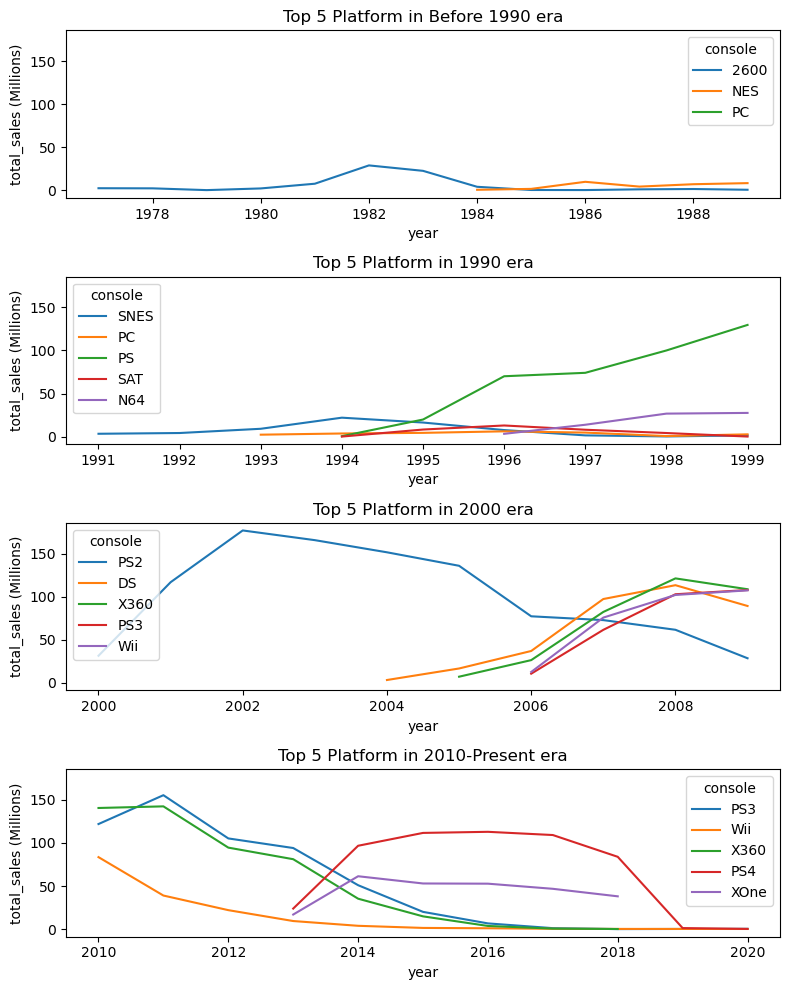
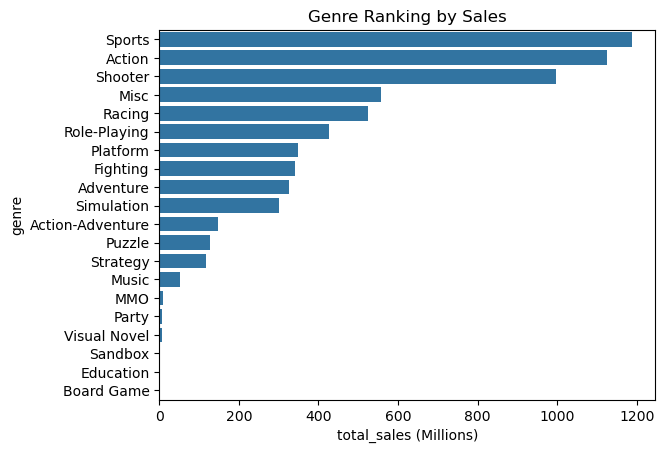
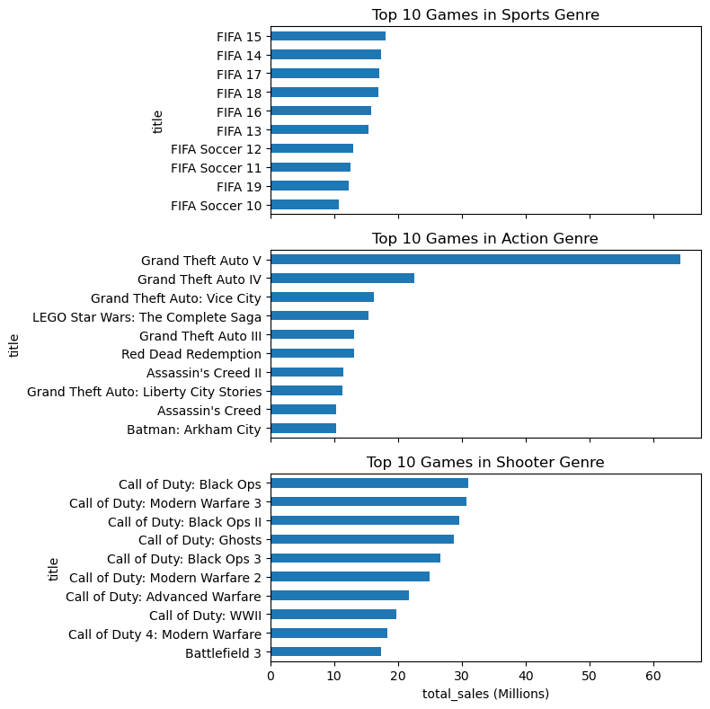
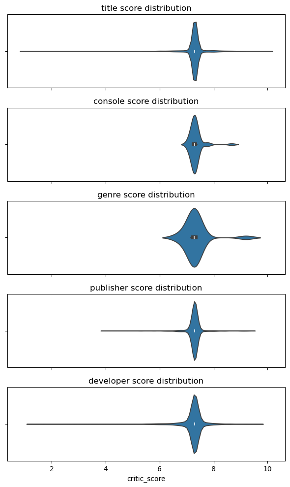
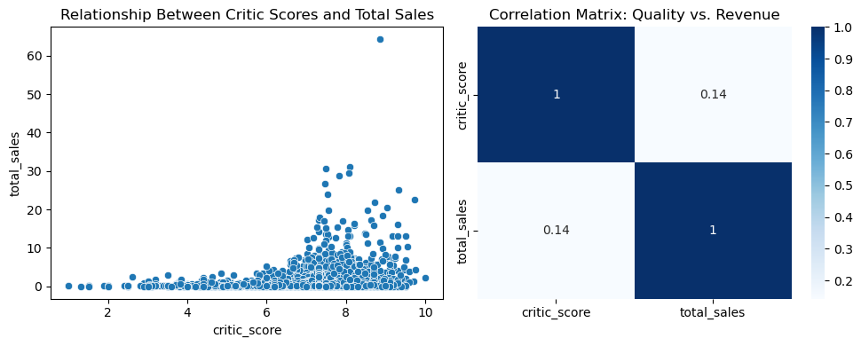
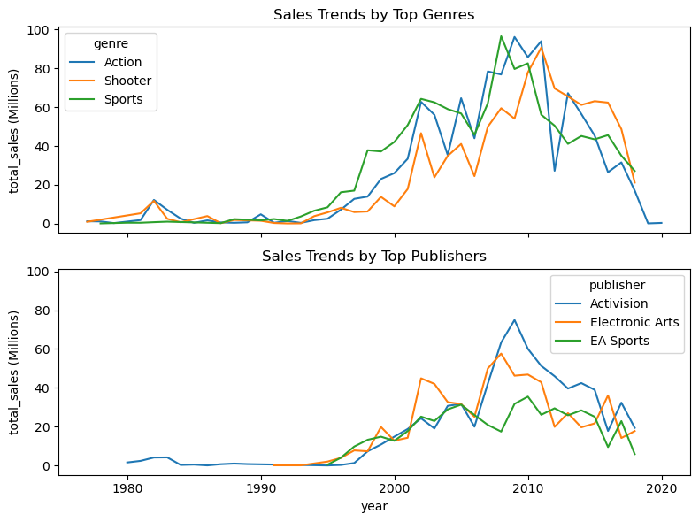

# Video Game Sales & Industry Data: EDA

## Project Overview
* **Objective:** This project aims to empower game developers, publishers, and investors by uncovering historical video game market trends, showing them **how** genres, platforms, and critical reception influence commercial success, and **who** the key industry players are.
* **Data Cleaning:** I cleaned and standardized the dataset by lowercasing headers, formatting dates, and engineering new temporal features.
* **Exploratory Data Analysis (EDA):** I performed comprehensive data analysis to identify market concentrations, console dominance, franchise power, and the relationship between game scores and total sales.

## Objective
My primary goal for this project was to understand the driving forces behind the video game industry's commercial success from 1980 to 2024. The **Value Created** lies in transforming raw historical sales data into actionable insights. By analyzing genre popularity, publisher market share, and the financial impact of critic scores, I provide a data-backed perspective that helps industry stakeholders make informed decisions about future game development, platform targeting, and marketing investments.

## Resources Used
* **Data Source:** [Video Game Sales & Industry Data (1980 - 2024)](https://www.kaggle.com/datasets/bhushandivekar/video-game-sales-and-industry-data-1980-2024?select=Video_Games_Sales_Cleaned.csv)
* **Libraries & Packages:** `kagglehub`, `pandas`, `seaborn`, `matplotlib`

## Project Features Explanation
* **title:** The name of the video game.
* **console:** The gaming platform or console on which the game was released.
* **genre:** The category or type of the game (e.g., Action, Sports, Shooter).
* **publisher:** The company responsible for publishing and marketing the game.
* **developer:** The studio or team that created the game.
* **critic_score:** The average review score given to the game by professional critics (typically out of 10).
* **total_sales:** The total global sales of the game (in millions of units).
* **release_year:** The year the game was officially launched to the public.

## Data Cleaning
To prepare the dataset for analysis, I performed the following data cleaning and preprocessing steps in my notebook:
* Loaded the dataset seamlessly using the Kaggle API.
* Standardized all column headers to `snake_case` by lowercasing, stripping whitespace, and replacing spaces with underscores to ensure consistent referencing.
* Converted the `release_year` column into a proper pandas datetime format.
* Engineered new categorical features (`year` and `era`) from the release dates to facilitate historical trend analysis.

## Exploratory Data Analysis (EDA)
By analyzing the data through various visualizations, I uncovered several detailed insights about the video game industry's structure and history:

* **Market Concentration & Best-Sellers:** 
    * A massive portion of industry revenue is driven by a very small number of entities. The top 20% of games account for nearly 80% of total sales. 

    

    * At the corporate level, the top 10 publishers control 58.7% of the global market, and the top 10 developers manage roughly 33.3% (*EA Canada* ranks as the #1 developer overall).
    
    
    

    * On an individual game level, *Grand Theft Auto V* is an extreme outlier, selling double the copies of its closest competitor.

    

* **Console Dominance & Platform Wars:** 
    * Hardware platforms heavily dictate market reach, with the top 10 consoles capturing 83% of all historical sales. 
    
    
    
    * Sony's PlayStation series shows a legacy of dominance: the PS1 held a 61.25% market share in the 1990s, and the PS2 became the highest-selling console of all time with a 30.6% share in the 2000s. 

        

* **Genre Leaders & Franchise Power:** 
    * Sports, Action, and Shooter are definitively the most genres. 
    
    
    
    * The data shows that major franchises absolutely monopolize these top categories. For instance, *FIFA* games occupy every single spot in the top 10 Sports list. Similarly, *Grand Theft Auto* takes 5 of the top 10 Action spots, and *Call of Duty* claims 9 of the top 10 Shooter spots.

    

* **Critic Scores vs. Commercial Success:** 
    * I analyzed whether high-quality reviews translate to higher revenue. The average game scores around a 7.3/10. 

    
    
    * I found that high scores do not guarantee commercial success—for example, highly-rated Sandbox games or Game Boy Color exclusives often don't top the global sales charts. However, poor quality is a strong predictor of failure; games that score below a 5/10 almost universally suffer from exceptionally low sales.

    

* **Historical Market Trends:** 
    * Tracking sales over eras revealed that the industry experienced explosive growth throughout the 2000s, peaking heavily between 2008 and 2009 before stabilizing in the digital era. Certain publishers leveraged this boom effectively; for example, *Activision* saw a massive and distinct revenue spike post-2005.

    